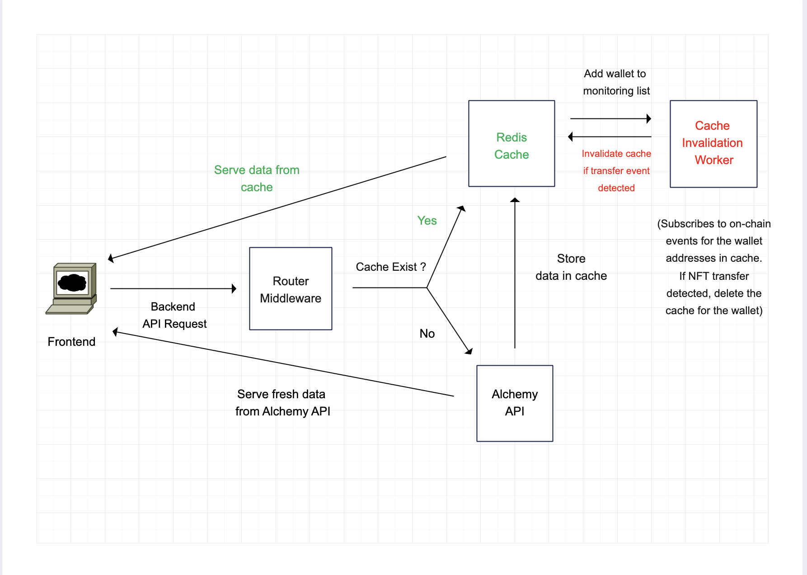

# Overview

A simple web application that allows users to enter an Ethereum wallet address and displays a list of Pudgy Penguins NFTs (or any other) held by that address.

# EC2 Deployment

Deployed and script running via systemctl

- Frontend Interface:
  [http://ec2-51-20-64-205.eu-north-1.compute.amazonaws.com:3000/]

- Backend API:
  [http://ec2-51-20-64-205.eu-north-1.compute.amazonaws.com:3001/api/nft/0x00000E8C78e461678E455b1f6878Bb0ce50ce587/0xa7f551FEAb03D1F34138c900e7C08821F3C3d1d0]


# Architecture Diagram

- This architecture is intended to optimise the response for end users.
- Reduces external third-party HTTP API calls by using Redis caching Layer.
- An invalidation worker microservice which monitors on-chain events (via websocket) and invalidates a cache if NFT Transfer event is detected for a wallet.



# Technologies Used

Backend: 
- Server: <b>Nodejs(Express)</b>
- Third-Party API: <b>Alchemy</b>

Caching Layer: 
 - <b>Redis</b>

Frontend: 
- Framework: <b>ReactJS</b>

# Setup Instructions

### Prerequisites:

- Node & npm:
[https://docs.npmjs.com/downloading-and-installing-node-js-and-npm](https://docs.npmjs.com/downloading-and-installing-node-js-and-npm)

- Redis (Optional)
  
    On MAC (using homebrew)

    ```
    brew install redis
    ```

    Other: [https://redis.io/docs/latest/operate/oss_and_stack/install/install-redis/]


### Installation:

1. Install Project
    ```
    git clone https://github.com/redmont/balthazar-DAO-NFT.git
    cd balthazar-DAO-NFT/backend
    npm i
    cd ../frontend
    npm i
    ```
2. Edit .env file

    ```
    vi balthazar-DAO-NFT/backend/.env
    
    ALCHEMY_KEY="YOGCFao8H1mCzIieh2VXMR7lFtgAI_lj" // Sample Api Key
    REDIS_SUPPORT=true // Whether you wanna enable or disable redis caching logic
    ```

3. Run Project

- Start Redis server (Optional)

    ```
    On MAC (if installed using homebrew)
    brew services start redis
    
    Other:
    [https://redis.io/docs/latest/operate/oss_and_stack/install/install-redis/]
    ```

- Backend
    ```
    // Open a new command tab
    // navigate to backend directory

    cd balthazar-DAO-NFT/backend
    npm start
    ```
- Frontend
    ```
    // Open a new command tab
    // navigate to frontend directory

    cd balthazar-DAO-NFT/frontend
    npm start
    ```


